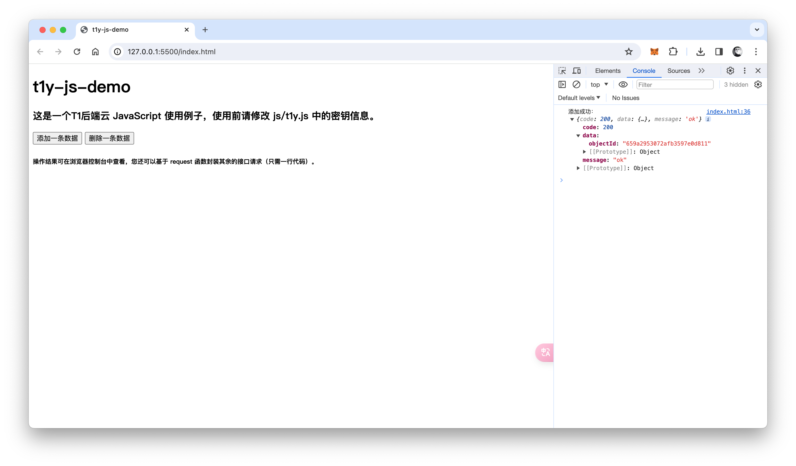

# t1y-js-demo

这是一个 T1 后端云 `JavaScript` 使用例子，使用前请修改 `js/t1y.js` 中的密钥信息。操作结果可在浏览器控制台中查看，您还可以基于 `request` 函数封装其余的接口请求（只需一行代码）。



## t1y.js

```js
const T1Y_API_URL = "https://api.t1y.net"; // 您的T1后端云域名
const T1Y_APP_ID = "1001"; // 您的 APP ID
const T1Y_APP_API_KEY = "2c6118c4e02b40fe96f5c40ee1dc5561"; // 您的 API Key
const T1Y_APP_SECRET_KEY = "650bd657da0243b282d9cab6d75a80ff"; // 您的 Secret Key

function createOne(table, params) {
  // 添加一条数据
  return request(`/v5/classes/${table}`, params, "post");
}

function deleteOne(table, id) {
  // 删除一条数据
  return request(`/v5/classes/${table}/${id}`, {}, "delete");
}

// 使用 request 函数封装更多的接口操作……

function request(path, params, type) {
  // 封装统一请求函数
  const url = new URL(T1Y_API_URL + path); // 构建完整请求url
  const nonceStr = md5(Math.floor(Math.random() * (1000 - 1 + 1)) + 1); // 生成32位随机数安全码
  const timestamp = Math.floor(Date.now() / 1000); // 获取当前时间戳，精确到秒
  return axios({
    url: url.toString(),
    method: type,
    data: type === "get" ? undefined : params,
    params: type === "get" ? params : undefined,
    headers: {
      // 构建T1后端云请求加密头
      "X-T1Y-Application-ID": T1Y_APP_ID,
      "X-T1Y-Api-Key": T1Y_APP_API_KEY,
      "X-T1Y-Safe-NonceStr": nonceStr,
      "X-T1Y-Safe-Timestamp": timestamp,
      "X-T1Y-Safe-Sign": md5(
        url.pathname +
          T1Y_APP_ID +
          T1Y_APP_API_KEY +
          nonceStr +
          timestamp +
          T1Y_APP_SECRET_KEY
      ), // 生成请求签名
    },
  });
}

function md5(text) {
  return CryptoJS.MD5(text).toString();
}
```

## 使用

使用前，确保当前项目中引入了 axios、crypto-js、t1y 这几个 js 文件。

```js
createOne("test", { a: 1, b: 2 })
  .then((response) => {
    console.log("添加成功：", response.data);
  })
  .catch((error) => {
    console.error("Error:", error);
  });
```

## 完整代码

```html
<!DOCTYPE html>
<html lang="zh-CN">
  <head>
    <meta charset="UTF-8" />
    <meta name="viewport" content="width=device-width, initial-scale=1.0" />
    <title>t1y-js-demo</title>
    <script src="./js/axios.min.js"></script>
    <script src="./js/crypto-js.js"></script>
    <script src="./js/t1y.js"></script>
  </head>
  <body>
    <div>
      <h1>t1y-js-demo</h1>
      <h3>
        这是一个T1后端云 JavaScript 使用例子，使用前请修改 js/t1y.js
        中的密钥信息。
      </h3>
    </div>
    <div>
      <button onclick="_createOne()">添加一条数据</button>
      <button onclick="_deleteOne()">删除一条数据</button>
    </div>
    <div>
      <h6>
        操作结果可在浏览器控制台中查看，您还可以基于 request
        函数封装其余的接口请求（只需一行代码）。
      </h6>
    </div>
    <script>
      var objectId = "";
      function _createOne() {
        // 向 test 表中添加数据
        createOne("test", { a: 1, b: 2 })
          .then((response) => {
            objectId = response.data.data.objectId; // 添加成功后将 objectId 保存下来
            console.log("添加成功：", response.data);
          })
          .catch((error) => {
            console.error("Error:", error);
          });
      }

      function _deleteOne() {
        // 删除指定 ID 数据（确保 ID 正确才能被删除）
        deleteOne("test", objectId) // 删除刚刚添加的数据
          .then((response) => {
            console.log("删除成功：", response.data);
          })
          .catch((error) => {
            console.error("Error:", error);
          });
      }
    </script>
  </body>
</html>
```
